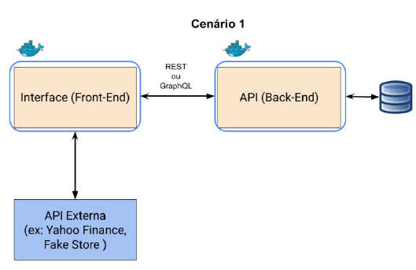

# Minha API em REST - Projeto Final do Módulo de Backend Avançado

## MVP da Pós em Full Stack da PucRio - Parte 3 - Desenvolvimento Back End Avançado 

O objetivo aqui é atender aos requisitos do MVP através de um aplicativo para controlar os ativos financeiros de um usuário.




O ativo será informado no formato da B3, com o código, descrição, quantidade e preço médio e a API do BackEnd ficará responsável por no Banco de Dados.
Também será funcionalidade da API recuperar essa informação para uso em um FrontEnd.

Foi utilizado o formato de API Rest, com as seguintes rotas:

* DELETE Ativo - Remove um ativo a partir do código informado
* GET Ativo - Busca por um ativo conforme o código informado
* POST Ativo - Adiciona um novo ativo à base de dados
* GET Ativos - Retorna todos os ativos existentes na base


## Como executar
Será necessário ter todas as libs python listadas no requirements.txt instaladas. Após clonar o repositório, é necessário ir ao diretório raiz, pelo terminal, para poder executar os comandos descritos abaixo.

É fortemente indicado o uso de ambientes virtuais do tipo virtualenv.
```
(env)$ pip install -r requirements.txt
```
Este comando instala as dependências/bibliotecas, descritas no arquivo requirements.txt.

Para executar a API basta executar:
```
(env)$ flask run --host 0.0.0.0 --port 5000
```

Em modo de desenvolvimento é recomendado executar utilizando o parâmetro reload, que reiniciará o servidor automaticamente após uma mudança no código fonte.

```
(env)$ flask run --host 0.0.0.0 --port 5000 --reload
```

Abra o http://localhost:5000/#/ no navegador para verificar o status da API em execução."# pucrio_mvp_fs_backEnd_avancado"

## Como executar através do Docker

Passo 1 - Confirme que o Docker foi instalado corretamente. Informações para instalação disponíveis em: https://docs.docker.com/engine/install/

Passo 2 - Utilizando o terminal, navegue até o diretório que contém o Docker file e execute o seguinte comando para criar a imagem:

```
docker build -t restaspi_mvp3_ativos .
```

Passo 3 - Execute o seguinte comando para executar a imagem
```
$ docker run -p 5000:5000 restaspi_mvp3_ativos
```

Uma vez executando, para acessar a API, basta abrir o http://localhost:5000/#/ no navegador.

## Autor

Carlos Eduardo Libero da Silva - clibero@gmail.com